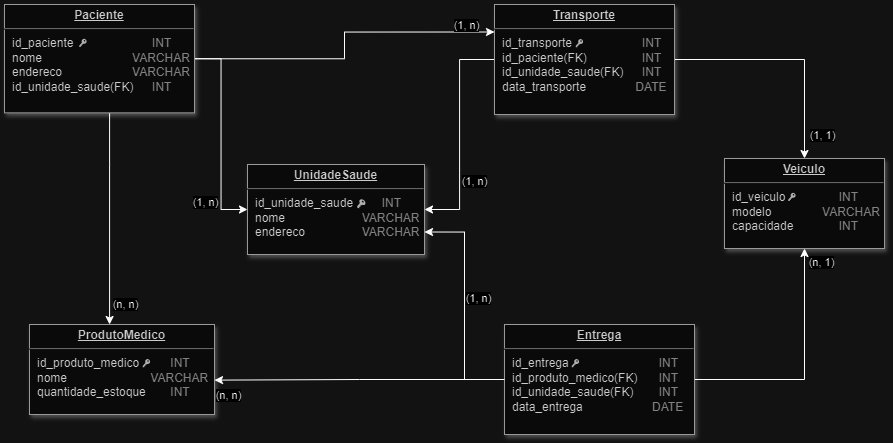
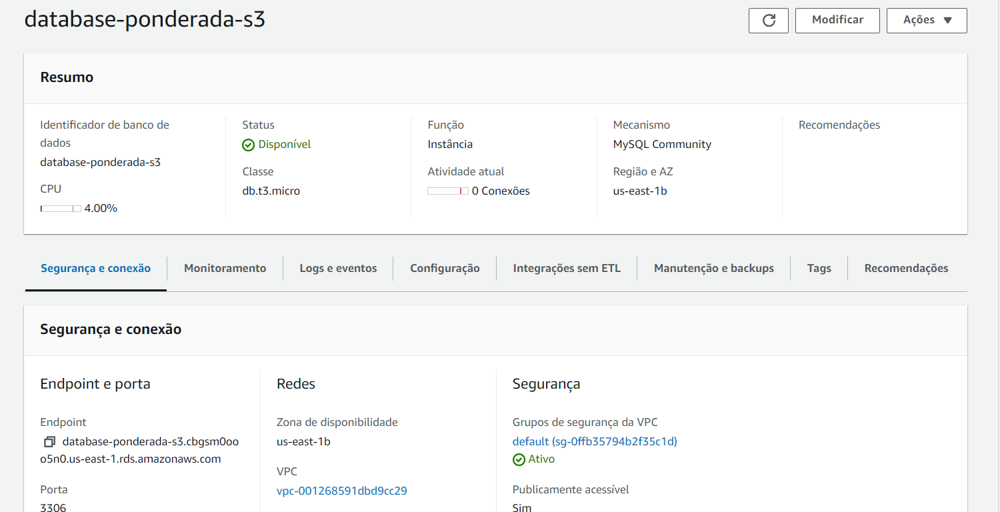
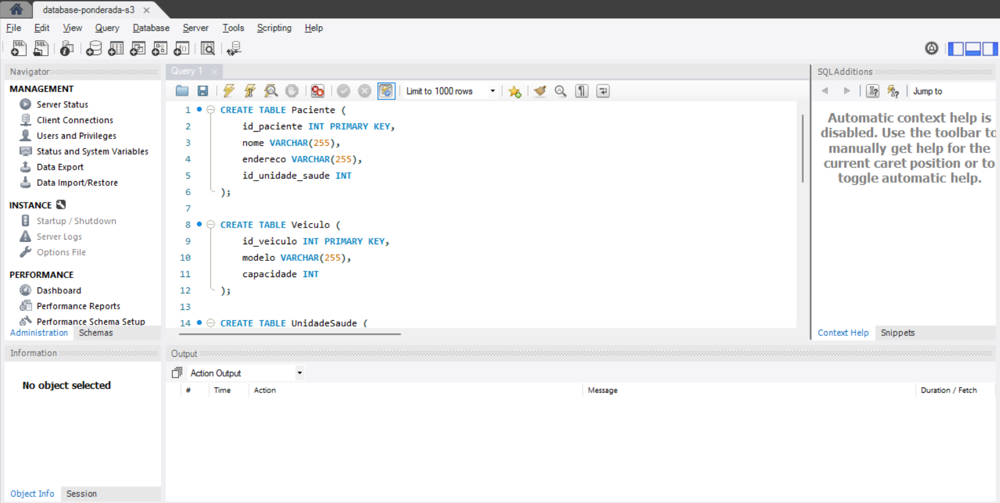
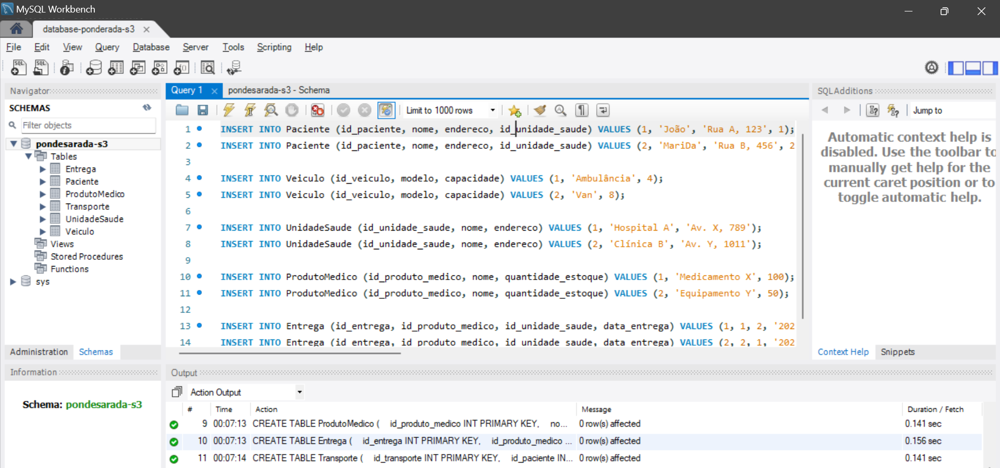
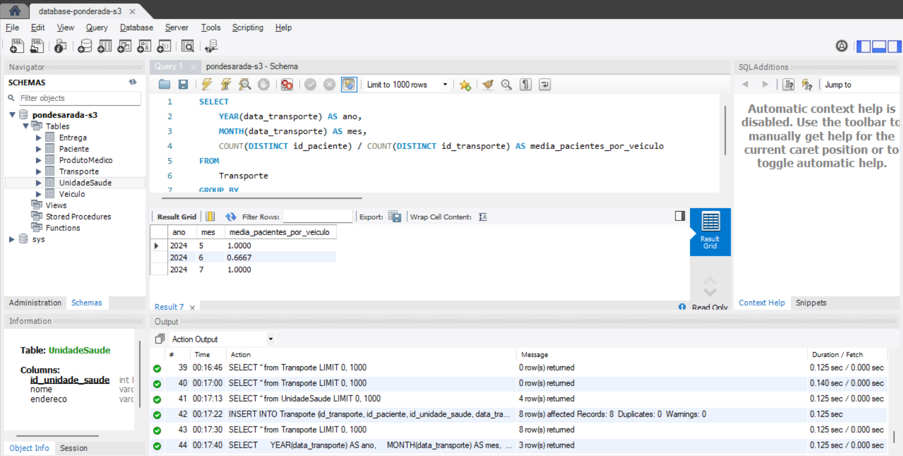

# ponderada_m6_s3_banco

# Introdução
&emsp;Esta entrega consiste na conclusão da atividade de desenvolvimento de um banco de dados para aprimorar a prestação de serviços de transporte relacionados à saúde e à entrega de produtos médicos. 

## 1. Modelo Lógico do Banco de Dados
&emsp;O modelo lógico foi criado para atender minimamente ao problema proposto, considerando as entidades Paciente, Veiculo, ProdutoMédico, UnidadeSaude, Transporte e Entrega. O diagrama do modelo lógico pode ser visualizado a seguir:



### Relacionamentos das tabelas:

**De Paciente para Unidade de Saúde**: Essa relação é de 1 para N, pois um paciente está associado a uma única unidade de saúde, mas uma unidade de saúde pode estar associada a vários pacientes.

**De Paciente para Produto Médico**: Essa relação é de N para N, pois um paciente pode estar associado a vários produtos médicos, e um produto médico pode estar associado a vários pacientes.

**De Entrega para Unidade de Saúde**: Essa relação é de 1 para N, pois uma entrega é feita para uma única unidade de saúde, mas uma unidade de saúde pode receber várias entregas.

**De Transporte para Unidade de Saúde**: Essa relação é de 1 para N, pois uma unidade de sáude pode ter o registro de vários transportes de pacientes.

**De Entrega para Unidade de Saúde**: Essa relação é de 1 para N, pois uma unidade de sáude pode ter o registro de várias entregas de produtos.

**De Entrega para Produto Médico**: Essa relação é de N para N, pois uma entrega inclui vários produtos médicos, que podem ser entregues várias vezes.

**De Entrega para Veículo**: Essa relação é de N para 1, pois uma entrega é realizada por um único veículo, mas um veículo pode realizar várias entregas.

**De Transporte para Veículo**: Essa relação é de 1 para 1, pois um veículo só pode transportar um paciente por vez.

## 2. Deploy do Banco de Dados no MySQL RDS da AWS
&emsp;O banco de dados foi implantado em um serviço MySQL RDS da AWS.

### Passo a passo realizado:
- Criar uma instância RDS utilizando o laboratório do AWS Academy;
- Realizar o deploy do MySQL na instância RDS criada;
- Utilizar o diagrama criado para estruturação do banco
- Executar as consultas

### Consultas

**Criação das tabelas**
```sql
CREATE TABLE Paciente (
    id_paciente INT PRIMARY KEY,
    nome VARCHAR(255),
    endereco VARCHAR(255),
    id_unidade_saude INT
);

CREATE TABLE Veiculo (
    id_veiculo INT PRIMARY KEY,
    modelo VARCHAR(255),
    capacidade INT
);

CREATE TABLE UnidadeSaude (
    id_unidade_saude INT PRIMARY KEY,
    nome VARCHAR(255),
    endereco VARCHAR(255)
);

CREATE TABLE ProdutoMedico (
    id_produto_medico INT PRIMARY KEY,
    nome VARCHAR(255),
    quantidade_estoque INT
);

CREATE TABLE Entrega (
    id_entrega INT PRIMARY KEY,
    id_produto_medico INT,
    id_unidade_saude INT,
    data_entrega DATE
);

CREATE TABLE Transporte (
    id_transporte INT PRIMARY KEY,
    id_paciente INT,
    id_unidade_saude INT,
    data_transporte DATE
);
```

**Exemplo de inserção de alguns dados**
```sql
INSERT INTO Paciente (id_paciente, nome, endereco, id_unidade_saude) VALUES (1, 'João', 'Rua A, 123', 1);
INSERT INTO Paciente (id_paciente, nome, endereco, id_unidade_saude) VALUES (2, 'Maria', 'Rua B, 456', 2);

INSERT INTO Veiculo (id_veiculo, modelo, capacidade) VALUES (1, 'Ambulância', 4);
INSERT INTO Veiculo (id_veiculo, modelo, capacidade) VALUES (2, 'Van', 8);

INSERT INTO UnidadeSaude (id_unidade_saude, nome, endereco) VALUES (1, 'Hospital A', 'Av. X, 789');
INSERT INTO UnidadeSaude (id_unidade_saude, nome, endereco) VALUES (2, 'Clínica B', 'Av. Y, 1011');

INSERT INTO ProdutoMedico (id_produto_medico, nome, quantidade_estoque) VALUES (1, 'Medicamento X', 100);
INSERT INTO ProdutoMedico (id_produto_medico, nome, quantidade_estoque) VALUES (2, 'Equipamento Y', 50);

INSERT INTO Entrega (id_entrega, id_produto_medico, id_unidade_saude, data_entrega) VALUES (1, 1, 2, '2022-05-01');
INSERT INTO Entrega (id_entrega, id_produto_medico, id_unidade_saude, data_entrega) VALUES (2, 2, 1, '2022-05-05');
```

**Calcular número médio de pacientes transportados**
```sql
SELECT 
    YEAR(data_transporte) AS ano,
    MONTH(data_transporte) AS mes,
    COUNT(DISTINCT id_paciente) / COUNT(DISTINCT id_transporte) AS media_pacientes_por_veiculo
FROM 
    Transporte
GROUP BY 
    YEAR(data_transporte), MONTH(data_transporte);

```

### Imagens do passo a passo:








  
